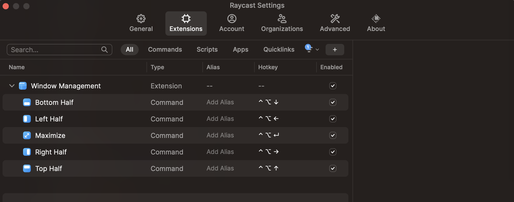

# dotfiles
## Installation
Clone this repository
```bash
git clone https://github.com/db0x0db/dotfiles
```

### `Xcode Command Line Tools` & `Homebrew`
```bash
xcode-select --install
/bin/bash -c "$(curl -fsSL https://raw.githubusercontent.com/Homebrew/install/HEAD/install.sh)"
```

### CLI Tools (brew)
```bash
brew install asciinema direnv neovim glow jq yq
```

### fzf
```bash
brew install fzf

# To install useful key bindings and fuzzy completion:
$(brew --prefix)/opt/fzf/install
```

### stow
Install `stow` and create soft link for dotfiles
```bash
brew install stow

cd dotfiles # cd to this repository
stow $(ls -d */ | grep -v 'images\|cargo') -t $HOME
```

### WezTerm
Install [WezTerm](https://wezfurlong.org/wezterm/) and fonts
```bash
brew tap wez/wezterm
brew install --cask wez/wezterm/wezterm

brew tap homebrew/cask-fonts
brew install font-jetbrains-mono-nerd-font font-codicon
```

### Raycast
Install [Raycast](https://www.raycast.com/) and configure extension settings



### `Oh My Zsh`
Install `Oh My Zsh` and plugins
```bash
sh -c "$(curl -fsSL https://raw.githubusercontent.com/ohmyzsh/ohmyzsh/master/tools/install.sh)"

# zsh-completions
git clone https://github.com/zsh-users/zsh-completions ${ZSH_CUSTOM:-${ZSH:-~/.oh-my-zsh}/custom}/plugins/zsh-completions
# zsh-autosuggestions
git clone https://github.com/zsh-users/zsh-autosuggestions ${ZSH_CUSTOM:-~/.oh-my-zsh/custom}/plugins/zsh-autosuggestions
# zsh-syntax-highlighting
git clone https://github.com/zsh-users/zsh-syntax-highlighting.git ${ZSH_CUSTOM:-~/.oh-my-zsh/custom}/plugins/zsh-syntax-highlighting
```

### Rust
Install Rust, toolchain, [sccache](https://github.com/mozilla/sccache) and [cargo-binstall](https://github.com/cargo-bins/cargo-binstall)
```bash
curl --proto '=https' --tlsv1.2 -sSf https://sh.rustup.rs | bash -s -- --verbose -y --no-modify-path
rustup component add rust-src
rustup toolchain install nightly
cargo install sccache cargo-binstall

cd dotfiles # cd to this repository
stow cargo -t $HOME
```

### CLI Tools (cargo)
Install CLI tools via cargo
```bash
cargo binstall bottom choose dua-cli fd-find git-delta gitui hexyl \
    huniq hyperfine jless just ouch pueue ripgrep rm-improved sd \
    tuc xh zoxide
```

### asdf
Install [asdf](https://asdf-vm.com/)
```bash
brew install coreutils # dependency
brew install asdf
```

### Python
Install Python via asdf and IPython, pre-commit, ruff, black, Poetry
```bash
asdf plugin-add python
asdf install python latest
asdf global python latest
```

### CLI Tools (pip)
Development tools
```bash
pip install ipython pre-commit ruff black
curl -sSL https://install.python-poetry.org | python3 -
```

Other tools
```bash
brew install ffmpeg && pip install yt-dlp
```

### NodeJS
Install NodeJS via asdf
```bash
asdf plugin add nodejs https://github.com/asdf-vm/asdf-nodejs.git
asdf install nodejs latest
asdf global nodejs latest
```

### Solidity
Install Solidity via [solc-select](https://github.com/crytic/solc-select)
```bash
pip install solc-select
latest=$(solc-select install | tail -1)
solc-select install $latest
solc-select use $latest
unset latest
```

Install [Foundry](https://github.com/foundry-rs/foundry)
```bash
brew install libusb # dependency
curl -L https://foundry.paradigm.xyz | bash
foundryup
```
